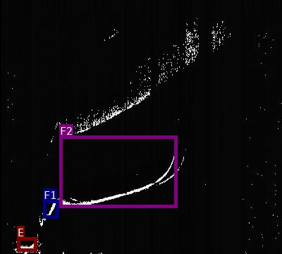
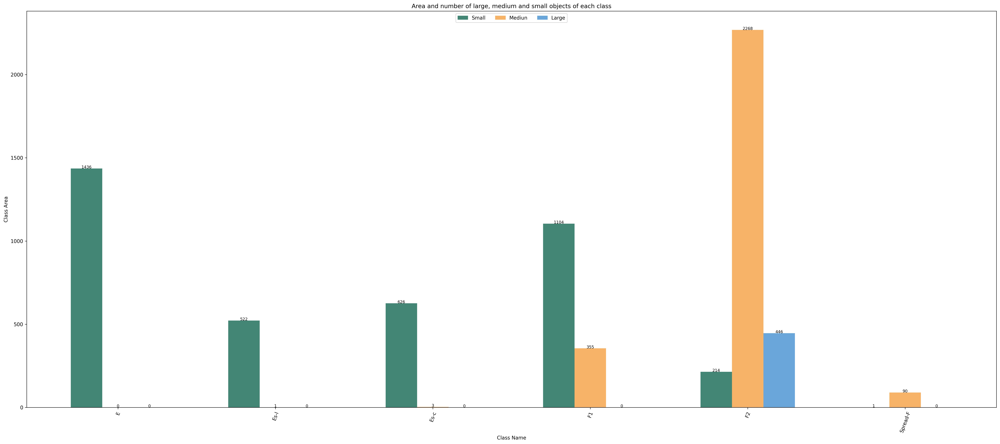
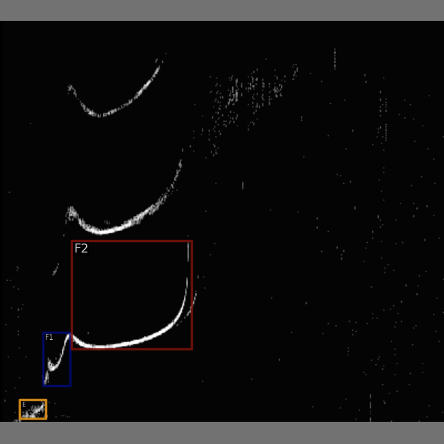
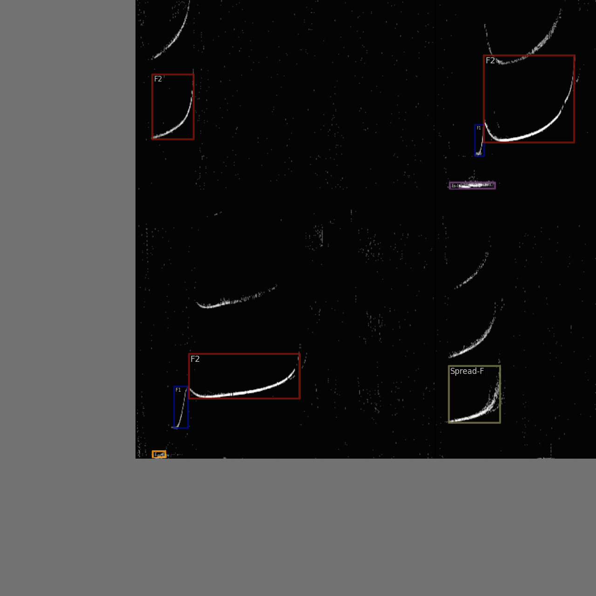
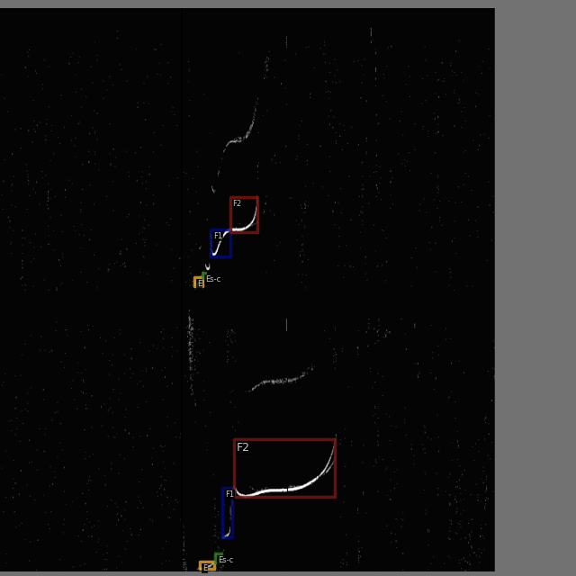
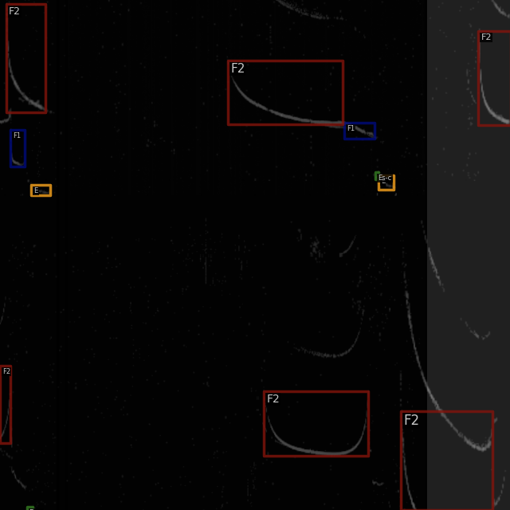
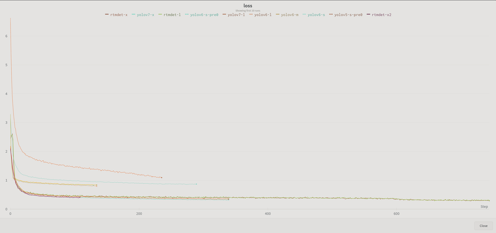

# 基于 YOLO 系列算法的频高图度量 benchmark

## 数据集构建

电离层频高图是获取电离层实时信息最重要的途径。电离层不规则结构变化特征研究对检测电离层不规则结构，精准提取和度量电离层各层轨迹和关键参数，具有非常重要的研究意义。

利用中国科学院在海南、武汉、怀来获取的不同季节的4311张频高图建立数据集，人工标注出E层、Es-c层、Es-l层、F1层、F2层、Spread F层共6种结构。[download](https://drive.google.com/file/d/1MZUonB6E0o7lq_NndI-F3PEVkQH3C8pz/view?usp=sharing)

File tree:

```shell
Iono4311/
├── annotations
│   ├── annotations_all.json
│   ├── class_with_id.txt
│   ├── test.json
│   ├── train.json
│   └── val.json
├── classes_with_id.txt
├── dataset_analysis.ipynb
├── dataset.ipynb
├── images
├── labels
├── test_images
├── train_images
└── val_images
```

标注图像预览



1. 数据集格式转换

使用MMYOLO提供的脚本将 labelme 的 label 转换为 COCO label。

```shell
python tools/dataset_converters/labelme2coco.py --img-dir ./Iono4311/images --labels-dir ./Iono4311/labels --out ./Iono4311/annotations/annotations_all.json
```

1. 浏览数据集

使用下面的命令可以将 COCO 的 label 在图片上进行显示，这一步可以验证刚刚转换是否有问题。

```shell
python tools/analysis_tools/browse_coco_json.py --img-dir ./Iono4311/images --ann-file ./Iono4311/annotations/annotations_all.json
```

1. 划分训练集、验证集、测试集

设置70%的图片为训练集，15%作为验证集，15%为测试集。

```shell
python tools/misc/coco_split.py --json ./Iono4311/annotations/annotations_all.json \
                                --out-dir ./Iono4311/annotations \
                                --ratios 0.7 0.15 0.15 \
                                --shuffle \
                                --seed 14
```

使用 [/tools/dataset_analysis.ipynb](OpenMMLabCamp/detection/ionogram_detection/tools/dataset_analysis.ipynb) 计算数据集中各类别实例数量：

```python
annotations_all 4311 images
      E  Esl  Esc    F1    F2  Fspread
0  2040  753  893  2059  4177      133

train 3019 images
      E  Esl  Esc    F1    F2  Fspread
0  1436  529  629  1459  2928       91

val 646 images
     E  Esl  Esc   F1   F2  Fspread
0  311  101  137  303  626       20

test 646 images
     E  Esl  Esc   F1   F2  Fspread
0  293  123  127  297  623       22
```

## 模型选择

4. 配置文件

配置文件在目录[/config/custom_dataset](/detection/ionogram_detection/config/custom_dataset)下

5. 数据集可视化分析

```shell
python tools/analysis_tools/dataset_analysis.py configs/custom_dataset/yolov5_s-v61_syncbn_fast_1xb32-50e_ionogram.py \
                                                --out-dir output
```



E、Es-l、Esc、F1类别以小目标居多，F2、Fspread类主要是中等大小目标。

6. 可视化config中的数据处理部分

以YOLOv5-m为例：

```shell
python tools/analysis_tools/browse_dataset.py configs/custom_dataset/yolov5_m-v61_syncbn_fast_1xb32-100e_ionogram.py \
--out-dir output --show-interval 1
```

根据配置文件中的`train_pipeline`，训练时采用的数据增强策略包括：

- 马赛克增强
- 仿射变换
- MixUp数据增强
- Albumentations数据增强工具包（包括多种数字图像处理方法）
- HSV随机增强图像
- 随机水平翻转

数据增强的可视化结果如下：

| Mosaic |                 | √                | √                | √                |
|--------|-----------------|------------------|------------------|------------------|
| Affine |                 |                  | √                | √                |
| Albu   |                 |                  |                  | √                |
| HSV    |                 |                  |                  | √                |
| Flip   |                 |                  |                  | √                |
| 可视化 |  |  ||  |

1. 修改Anchor尺寸

```shell
python tools/analysis_tools/optimize_anchors.py configs/custom_dataset/yolov5_s-v61_syncbn_fast_1xb32-100e_ionogram.py \
                                                --algorithm v5-k-means \
                                                --input-shape 640 640 \
                                                --prior-match-thr 4.0 \
                                                --out-dir work_dirs/dataset_analysis_5_s
```

8. 训练

```shell
python tools/train.py configs/custom_dataset/yolov5_s-v61_syncbn_fast_1xb32-100e_ionogram_pre0.py
```

9. 测试

```shell
python tools/test.py ./configs/custom_dataset/yolov6_l_syncbn_fast_1xb32-100e_ionogram.py \
./work_dirs/yolov6_l_100e/best_coco/bbox_mAP_epoch_76.pth \
--work-dir ./work_dirs/yolov6_l_100e \
--show-dir ./output \
--wait-time 1
```

10. 计算模型复杂度

[参考脚本](https://github.com/open-mmlab/mmyolo/blob/2875d8b64e75b34c2a7f4cf134f9348c2f018ed9/tools/analysis_tools/get_flops.py) 一个没有被 merge 的 pr（mmengine0.6.0将要官方支持）

编写一键打印所有模型的notebook[get_flops.ipynb](/detection/ionogram_detection/tools/get_flops.ipynb)

## 实验

### 选择合适的 batch size

- batch size主导了训练速度。通常，理想的 batch size 是是硬件能支持的最大 batch size。
- 当显存占用没有达到饱和时，如果 batch size 翻倍，训练吞吐量也应该翻倍（或接近翻倍）。训练时间应该减半或接近减半。
- 使用混合精度训练可以加快训练速度、减小显存。在执行`train.py`时添加`--amp`即可开启。

硬件信息：

- GPU：V100 32G
- CPU：10核40G

实验结果：

| Model    | epoch(best) | AMP   | Batchsize | Num workers | Memory Allocated | Training Time  | val mAP |
|----------|-------------|-------|-----------|-------------|------------------|----------------|---------|
| YOLOv5-s | 100(82)     | False | 32        | 6           | 35.07%           | 54 min         | 0.575   |
| YOLOv5-s | 100(96)     | True  | 32        | 6           | 24.93%           | 49 min         | 0.578   |
| YOLOv5-s | 100(100)    | False | 96        | 6           | 96.64%           | 48 min         | 0.571   |
| YOLOv5-s | 100(100)    | True  | 96        | 6           | 54.66%           | **37** min     | 0.575   |
| YOLOv5-s | 100(90)     | True  | 144       | 6           | 77.06%           | 39 min         | 0.573   |
| YOLOv5-s | 200(148)    | True  | 96        | 6           | 54.66%           | 72 min         | 0.575   |
| YOLOv5-s | 200(188)    | True  | 96        | **8**       | 54.66%           | 67 min         | 0.576   |

分析结果，可以得出以下结论：

- 使用混合精度训练队模型表现影响很小（约百分之零点几），并且可以明显减少显存占用。
- Batch size 增加三倍，和训练时长并没有相应地减小3倍。根据训练记录，batch size 越大，`data_time` 也越大，说明数据加载成为了瓶颈。增大加载数据的进程数（`num_workers`）可以加快数据加载。

### 频高图检测 banchmark

| Model | epoch(best) | FLOPs(G) | Params(M) | pretrain | val mAP | test mAP | config |
| --- | --- | --- | --- | --- | --- | --- | --- |
| YOLOv5-s | 50(50) | 7.95 | 7.04 | Coco | 0.579 | 0.567 | yolov5_s-v61_syncbn_fast_1xb32-50e_ionogram |
| YOLOv5-s | 100(75) | 7.95 | 7.04 | Coco | 0.577  | 0.584 | yolov5_s-v61_syncbn_fast_1xb32-100e_ionogram |
| YOLOv5-s | 200(145) | 7.95 | 7.04 | None | 0.565 | 0.581 | yolov5_s-v61_syncbn_fast_1xb32-100e_ionogram_pre0 |
| YOLOv5-m | 100(70) | 24.05 | 20.89 | Coco | 0.587  | 0.586 | yolov5_m-v61_syncbn_fast_1xb32-100e_ionogram |
| YOLOv6-s | 100(54) | 24.2 | 18.84 | Coco | 0.584 | 0.594 | yolov6_s_syncbn_fast_1xb32-100e_ionogram |
| YOLOv6-s | 200(188) | 24.2 | 18.84 | None | 0.557 | 0.564 | yolov6_s_syncbn_fast_1xb32-100e_ionogram_pre0 |
| YOLOv6-m | 100(76) | 37.08 | 44.42 | Coco | 0.590 | 0.590 | yolov6_m_syncbn_fast_1xb32-100e_ionogram |
| YOLOv6-l | 100(76) | 71.33 | 58.47 | Coco | 0.605 | 0.597 | yolov6_l_syncbn_fast_1xb32-100e_ionogram |
| YOLOv7-tiny | 100(78) | 6.57 | 6.02 | Coco | 0.549 | 0.568 | yolov7_tiny_syncbn_fast_1xb32-100e_ionogram |
| YOLOv7-x | 100(58) | 94.27 | 70.85 | Coco | 0.602 | 0.595 | yolov7_x_syncbn_fast_1xb32-100e_ionogram |
| rtmdet-s | 100(64) | 14.76 | 8.86 | Coco | 0.581 | 0.571 | rtmdet_s_syncbn_fast_1xb32-100e_ionogram |

[训练过程可视化](https://wandb.ai/19211416/mmyolo-tools/reports/Object-Detection-for-Ionogram-Automatic-Scaling--VmlldzozNTI4NTk5)

现有的实验结果中，YOLOv6-l的验证集mAP最高。

对比loss下降的过程可以发现，使用预训练权重时，loss下降得更快。可见即使是自然图像数据集上预训练的模型，在雷达图像数据集上微调，也可以加快收敛。



## 自定义数据集config修改经验

### 必须修改的项目

- \_base\_
- work_dir

### 模型尺寸不变，修改策略时

继承自修改过的config
根据实验需要修改config内容

### 修改模型尺寸时

继承自修改过的config

- num_classes related (e.g. loss_cls)
- load_from
- 官方config中的内容

### 使用新的模型训练自定义数据集

继承自官方config

- visualizer
- dataset settings
  - data_root
  - class_name
  - num_classes
  - metainfo
  - img_scale
- train, val, test
  - batch_size, num_workers
  - train_cfg
    - max_epochs, save_epoch_intervals, val_begin
  - default_hooks
    - max_keep_ckpts
    - save_best
  - lr
  - val_dataloder, test_dataloader
    - metainfo
    - root
  - val_evaluator, test_evaluator

## To Do

- 完善测试内容
- 使用两阶段模型
- 改进模型
